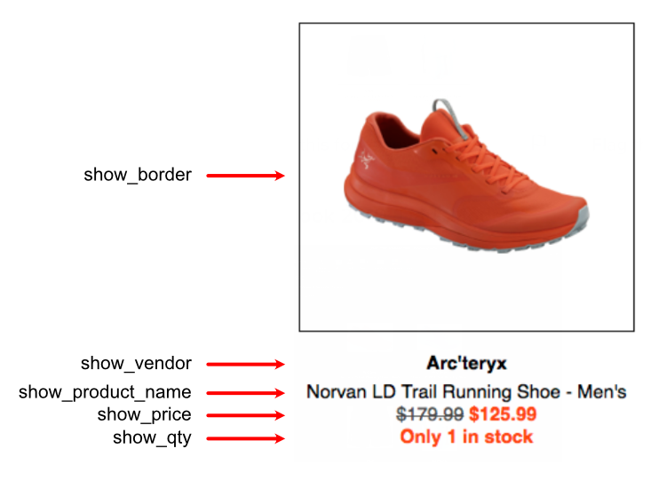

# Zaius Dynamic Grid

Use this template to build in [Zaius](https://app.zaius.com/) a custom grid of products for Altitude Sports and The Last Hunt newsletter. Given a list of skus, the dynamic grid will automatically populate a newsletter section with products informations. 

## Getting Started

The [Dynamic Grid](dynamic-grid.liquid) file contains your HTML template. You don't need to modify it. Use it as it is in a raw HTML section of Zaius. The [scripting](dynamic-grid-scripting.liquid) implement the logic of the dynamic grid. Use it in the scripting section of your raw HTML block in Zaius. If the customer is french, the template will be automatically translated.

### Using the scripting

The main section of the scripting is an array called products where you can define which products you want to show in your newsletter. To do so, you will need to modify the list of products skus. Don't forget to add the condition OR between all of your skus. 

Here is the detailed list of settings that you can modify in the scripting section.
 
Option | Type | Description
------ | ---- | -----------
column | number | Defines how much product in a row for desktop clients. On mobile or smaller devices, it is fixed to 2 products in a row.
show_border | boolean | Set the value to `true` to show a border around the product image.
is_tlh | boolean | If `true`, it will change the orange color value to match The Last Hunt's orange color.
show_vendor | boolean | Set to `true` to display the product vendor.
show_product_name | boolean | Set to `true` to display the product name.
show_price | boolean | Set to `true` to display the product price. If the product is currently on sale, the original price will be ~~strikethrough~~  and the discounted price will appear next in orange.
show_qty | boolean | Set the value to `true` to display a stock alert message. If the product quantity is 3 or less, the messge `Only X in stock` (`Plus que X en stock`). If the product is out of stock, it will show `Out of stock` (`Épuisé`).   

